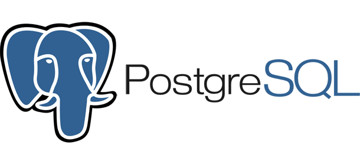
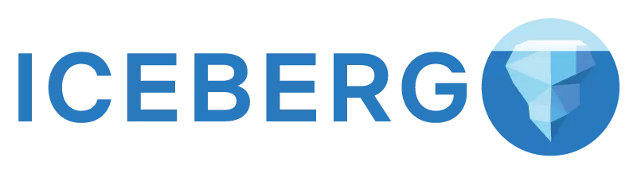

---
layout: v2_home
title: Home
description: Platformatory home page.
intro_image: "images/banners/pexels-maximilian-ruther-11589778.jpg"
intro_image_absolute: true
intro_image_hide_on_mobile: true
what_we_do_label: "Our superpowers in the cloud native landscape"
what_we_do: "Boutique engineering expertise, breadth & depth across,  <strong>Hyperscale Data, Event Streaming, Machine Learning and API-based connectivity</strong>."
sections:
  - title: Platform & Product Engineering, for the AI age.
    featured: false
    summary: "We transform our customers' tech estate and operating model with cloud-native infrastructure, real-time data and modern integration."
    raw_content: |
      <section style="background-image: url(../images/v2/banners/home-bg.jpg)" class="raw-section-container">
        

          

            <h1 class="col-md-8 col-12">Platform & Product Engineering, for the AI age.</h1>
            

              We transform our customers' tech estate and operating model with cloud-native infrastructure, real-time data and modern integration.  
            

          

          

            <blockquote>
              A product is useless without a platform, or more precisely and accurately, a platform-less product will always be replaced by an equivalent platform-ized product – <strong>Steve Yegge</strong>
            </blockquote>
          

        

      </section>
  - title: "APIs and interfaces are the real moat. Protocols trump platforms. Open source is the most robust form of capitalism."
    featured: false
    weight: 3
    summary: "We uniquely specialize in ubiquitous distributed system (platform) interfaces that power the cloud. "
    image: "../images/icons/automation.png"
    caption: "Automated deployment and scaling."
    hash: "infrastructure-automation"
    raw_content: |
       <section class="raw-section-container">
        

          

          

           <h2>We uniquely specialize in ubiquitous distributed system (platform) interfaces that power the cloud.</h2>
          

            

            
APIs and interfaces are the real moat.

            
Protocols trump platforms.

           
Open source is the most robust form of capitalism.

            

          

          

            
            
            
            
            
            
          

        

       </section>
  - title: "We execute a unique delivery model that is practitioner led. One-pizza teams are the rule. Punch above your weight, consistently."
    featured: true
    weight: 2
    summary: "Embed security into every layer of your platform for robust protection."
    image: "../images/icons/security-engineering.png"
    caption: "Comprehensive security strategies."
    hash: "security-engineering"
    raw_content: |
      <section class="raw-section-container">
        

          <h4>We execute a unique delivery model that is practitioner led. One-pizza teams are the rule. Punch above your weight, consistently.</h4>
         
        

      </section>
  - title: "Professional services & Partner-led growth"
    featured: false
    weight: 1
    summary: "Partnerships are truly strategic. Our partners value us for unparalleled customer centricity and our customers value us for our non-partisan commitment to the craft."
    image: "../images/icons/security-engineering.png"
    caption: "Comprehensive security strategies."
    hash: "security-engineering"
    # raw_content: |
    #   <section class="split-content">
    #   </section>
    section:
      class: "split-container"
      # image: "../images/v2/banners/druid.jpg"

--- 

# Platform & Product Engineering, for the AI age.

We transform our customers' tech estate and operating model with cloud-native infrastructure, real-time data and modern integration.

> A product is useless without a platform, or more precisely and accurately, a platform-less product will always be replaced by an equivalent platform-ized product – Steve Yegge 
