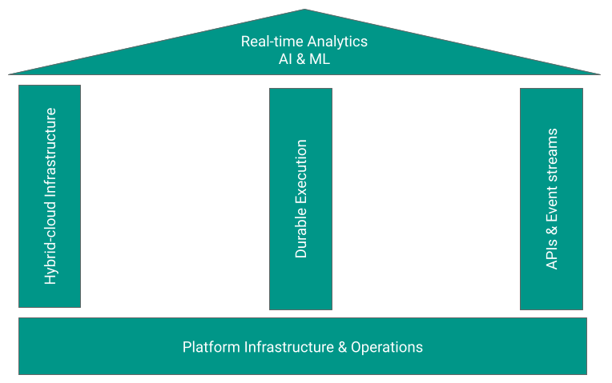

---
layout: v2_home
title: Home
description: Platformatory home page.
intro_image: "images/banners/pexels-maximilian-ruther-11589778.jpg"
intro_image_absolute: true
intro_image_hide_on_mobile: true
what_we_do_label: "Our superpowers in the cloud native landscape"
what_we_do: "Boutique engineering expertise, breadth & depth across,  <strong>Hyperscale Data, Event Streaming, Machine Learning and API-based connectivity</strong>."
sections:
  - title: Platform & Product Engineering, for the AI age.
    featured: false
    summary: "We transform our customers' tech estate and operating model with cloud-native infrastructure, real-time data and modern integration."
    raw_content: |
      <section  class="raw-section-container">
        

          

            <h1 class="text-capitalize mb-1 mb-xl-5">We Engineer Platforms & Products. the AI age.</h1>
           
 A product is useless without a platform, or more precisely and accurately, a platform-less product will always be replaced by an equivalent platform-ized product  – Steve Yegge

          
  
        

      </section>
  - title: Our field expertise here is unparalleled. 
    featured: false
    summary: ""
    raw_content: |
      <section class="raw-section-container">
        

          
          <h2 class="text-capitalize">Our field expertise here is unparalleled.</h2>
        

      </section>
  - title: "We have a unique thesis on what it takes to scale platform-led products."
    featured: true
    weight: 3
    summary: ""
    image: "../images/icons/automation.png"
    caption: "Automated deployment and scaling."
    hash: "infrastructure-automation"
    section:
      class: "split-container"
      feature_type: "list"
    features:
      - name: "Building on great platform primitives"
        description: "Specialize deeply on ubiquitous distributed systems interfaces (such as Apache Kafka, Kubernetes, PostgreSQL, Temporal and more). These are the building blocks."
      - name: "A commitment to small"
        description: "Create highly skilled, “one-pizza” teams to build & operate platforms that extract common cross-cutting concerns."
      - name: "A minimum viable level of self-service"
        description: "First class DevX, Human augmented AI and well governed, secure foundational tooling (for just about everything)"

  - title: "Partnerships (without partisanship)"
    featured: true
    weight: 2
    summary: "A promise to deliver real customer value on platform investments. "
    image: "../images/icons/security-engineering.png"
    caption: "Comprehensive security strategies."
    hash: "security-engineering"
    section:
      class: "split-container"
      feature_type: "images"
      grid_order_class: "reverse"
    features: 
      - name: "Partners"
        images: 
          - name: "Confluent"
            url: "../images/v2/partners/confluent.png"
          - name: "VmWare"
            url: "../images/v2/partners/vmware.png"
          - name: "Kong"
            url: "../images/v2/partners/kong.png"
          - name: "solo.io"
            url: "../images/v2/partners/solo.png"
      - name: "Customers"
        images:
          - name: "bosch"
            url: "../images/v2/customers/bosch.png"
          - name: "clearCaption"
            url: "../images/v2/customers/clearcaptions.png"
          - name: "ruller"
            url: "../images/v2/customers/ruller.png"

  - title: "Open-source, community and thought leadership"
    featured: true
    weight: 1
    summary: ""
    image: "../images/icons/security-engineering.png"
    caption: "Comprehensive security strategies."
    hash: "security-engineering"
    section:
      class: "split-container"
      feature_type: "images"
    features: 
      - name: "Meetup Communities"
        images: 
          - name: "Bengaluru streams"
            url: "../images/v2/meetup-community/streams.png"
          - name: "Large Scale Systems Bangalore"
            url: "../images/v2/meetup-community/large_scale_systems.png"
          - name: "Kong Meetup"
            url: "../images/v2/meetup-community/kong.png"
          - name: "Temporal Meetup"
            url: "../images/v2/meetup-community/temporal.png"
          - name: "Grafana Meetup"
            url: "../images/v2/meetup-community/grafana.png"
          - name: "Kafka"
            url: "../images/v2/meetup-community/kafka.png"
      - name: "Our SaaS Products"
        images:
          - name: "Apinomy" 
            url: "../images/v2/products/apinomy.png"
          - name: "Eventception"
            url: "../images/v2/products/eventception.png"
          - name: "RTDx"
            url: "../images/v2/products/rtdx.png"
      # image: "../images/v2/banners/druid.jpg"

--- 

# Platform & Product Engineering, for the AI age.

We transform our customers' tech estate and operating model with cloud-native infrastructure, real-time data and modern integration.

> A product is useless without a platform, or more precisely and accurately, a platform-less product will always be replaced by an equivalent platform-ized product – Steve Yegge 
